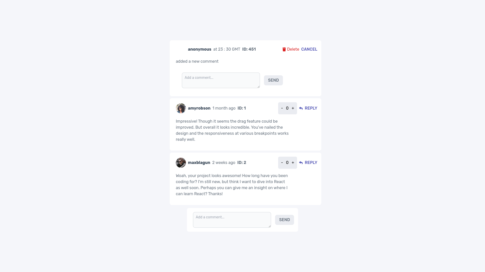

## Interactive comments section

## Table of contents

- [Overview](#overview)
  - [The challenge](#the-challenge)
  - [Screenshot](#screenshot)
  - [Links](#links)
- [My process](#my-process)
  - [Built with](#built-with)
  - [What I learned](#what-i-learned)
  - [Continued development](#continued-development)

## Overview

### The challenge

Users should be able to:

- View the optimal layout for the app depending on their device's screen size
- See hover states for all interactive elements on the page
- Create, Read, Update, and Delete comments and replies
- Upvote and downvote comments
- **Bonus**: If you're building a purely front-end project, use `localStorage` to save the current state in the browser that persists when the browser is refreshed.
- **Bonus**: Instead of using the `createdAt` strings from the `data.json` file, try using timestamps and dynamically track the time since the comment or reply was posted.

### Screenshot

### Links

- Solution URL: [Solution URL](https://github.com/sadiquex/nested-interactive-comments-section-FM)
- Live Site URL: [Live URL ](https://nested-interactive-comments-section-fm.vercel.app/)

## My process

### Built with

- Tailwind CSS
- [React](https://reactjs.org/) - JS library
- Semantic HTML5 markup
- CSS custom properties
- Flexbox & CSS Grid
- Mobile-first workflow
- Custom hooks
- Local Storage

### What I learned

- enhanced creating and using custom hooks skills
- Upvote and downvote comments

### Continued development

- fix the code for adding a reply
- use the useLocalStorage hook to persist data
